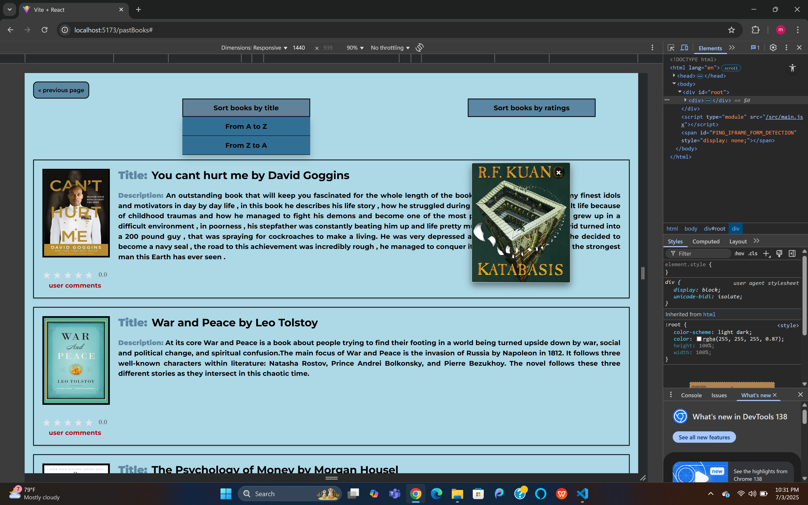
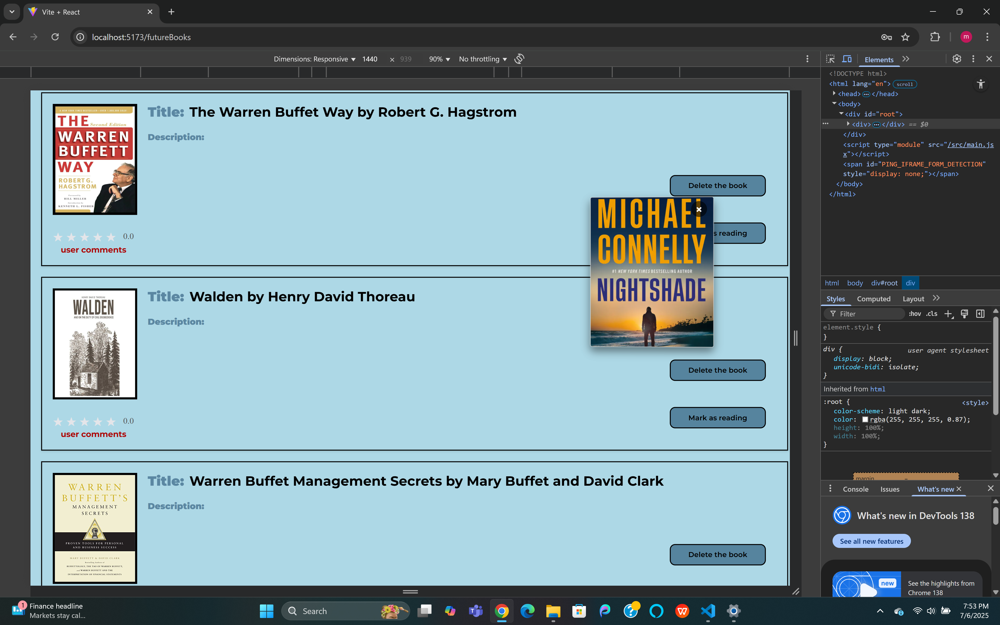

# 📚 IReadBooks

**IReadBooks.com** is a full-stack web application that enables admins to manage a digital bookshelf—tracking books they’ve read, are reading or plan to read. Users can explore the book collection, leave reviews, rate titles, and engage through comments.

Built using:
- 🧠 React (with Vite) for the frontend  
- ⚙️ Node.js & Express for the backend  
- 🗃 PostgreSQL for data storage  

---

## ✨ Features

### ✅ Fully Responsive Layout

Optimized for a seamless experience across all devices:

💻 **Laptops / Desktops**
- Homepage  
  
- Past Books  
  
- Sign Up  
  

📱 **Mobile Devices**
- Homepage  
  
- Past Books  
  
- Sign Up  
  

📱‍💻 **Tablets**
- Homepage  
  
- Past Books  
  
- Sign Up  
  

---

### 📢 New Book Release Promotions

A built-in **promotion engine** highlights newly released books across the app. These promotions function like in-app advertisements and are:

- Clickable book covers linking to external stores or publisher pages  
- Shown across pages and fully responsive

📸 **Examples:**
- Laptop view  
  
- Tablet view  
  
- Phone view  
  

---

### 👨‍💼 Admin Features

Admins can manage the entire book library:

- Add and delete books  
    
  

- Upload book covers  
  

- Add, edit, and delete descriptions  
  

- Manage book status:
  - Move from **Future Books** to **Currently Reading** using "Mark as reading"
  - Move from **Currently Reading** to **Read Books** using "Mark as done reading"

    
  

---

### 👤 User Features

Users can:

- Browse books in all categories  
    
    
    
  

- Sort books by title and rating  
    
  

- Sign up to post comments and rate books  
  

- Sign in and sign out  
    
    
  

- Post comments and rate books (1 to 5 stars)  
    
  

- Reset forgotten passwords via email  
  

---

## 🛠 Tech Stack

**Frontend**
- React + Vite
- React Router
- Axios

**Backend**
- Node.js + Express
- PostgreSQL
- Passport.js (authentication)
- Bcrypt (password hashing)
- Nodemailer (email/password reset)

---

## 🗂 Project Structure

```bash
IReadBooks/
├── backend/                        # Server-side code (Node.js, Express)
│   ├── node_modules/
│   ├── .env                        # Environment variables
│   ├── AdminAuth.js                # Admin auth middleware
│   ├── mailer.js                   # Email logic
│   ├── server.js                   # Main server file
│   ├── package.json
│   └── package-lock.json
│
├── frontend/                       # Client-side code (React, Vite)
│   ├── node_modules/
│   ├── public/                     # Static assets
│   ├── src/
│   │   ├── Routes/                 # React pages/components
│   │   │   ├── App.jsx
│   │   │   ├── Home.jsx
│   │   │   ├── PastBooks.jsx
│   │   │   ├── SignUpForm.jsx
│   │   │   ├── BookAds.jsx
│   │   │   ├── ForgotPassword.jsx
│   │   │   ├── LeaveAComment.jsx
│   │   │   └── ...
│   │   ├── App.css
│   │   ├── global.css
│   │   ├── index.js
│   ├── index.html
│   ├── vite.config.js
│   ├── package.json
│   └── package-lock.json
│
├── .gitignore
├── README.md


 